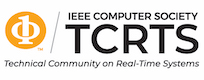

IEEE RTCSA 2023, the 29th IEEE International Conference on Embedded and Real-Time Computing Systems and Applications, will be held physically on August 30th - September 1st, 2023. It will be co-located with NVMSA 2023. The physical conference will take place at the TOKI MESSE Conference Center in Niigata, Japan. The conference proceedings will be included in IEEE Xplore, and indexed by EI."

# Venue
Located at the mouth of Shinano-river, in the heart of Niigata city, Toki Messe opened in 2003. The facility integrates exhibition hall capacitates more 10,000 people, 13 large sized and medium sized conference rooms, and the hotel, which is the landmark in Niigatacity. A Conference, a party, and accommodation, everything comes into only one space.

Conference venue: TOKI MESSE, Niigata Convention Center ([ACCESS](https://www.tokimesse.com/english/access/index.html))\
Address: 6-1 Bandaijima, Chuo-ku, Niigata City,Niigata 950-0078 Japan

# Sponsors
\

\

\
